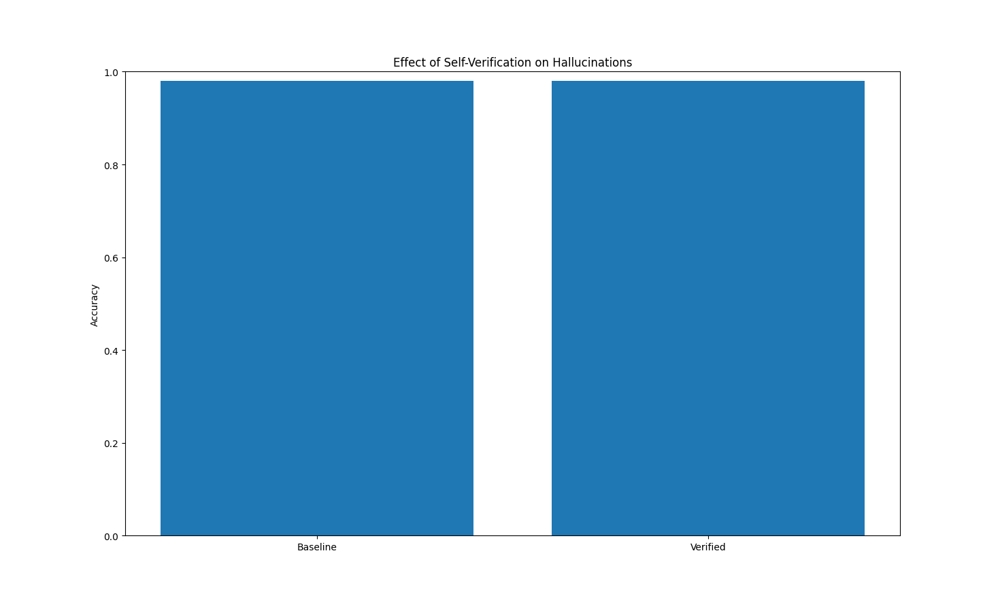

# Evaluating Self-Verification for Reducing LLM Hallucinations

## Overview
Large Language Models (LLMs) are known to produce **hallucinations**, they are confident but factually incorrect statements provided by LLMs.

This repository is part of an ongoing effort to **research and experiment with techniques that improve or reduce AI hallucinations** through small, controlled evaluations.

This repo documents **Experiment #1**, which evaluates a commonly proposed mitigation strategy: **self-verification**, where a model is asked to review and verify its own answer before finalizing it.

The goal is not to build a product or train a model, but to **understand model behavior through careful evaluation**.

---
## Research Question
**Does prompting an LLM to verify its own answer reduce factual hallucinations compared to answering directly?**

---

## Hypothesis
Self-verification may reduce hallucinations by encouraging more cautious reasoning.  
However, it may also introduce new errors by over-correcting or adding unnecessary ambiguity.

---

## Model Used
The experiment was conducted using **`gpt-4o-mini`**.

---

## Results



The chart above compares baseline accuracy against accuracy after self-verification.
Despite correcting some hallucinations, self-verification also introduced new errors,
resulting in no net improvement in overall accuracy despite localized gains and regressions.

---

## Key Takeaway
Self-verification can both correct and introduce hallucinations.
Without selectivity or uncertainty awareness, its overall benefit is inconsistent.

---

## Experimental Setup
- ~50 factual, single-answer questions
- Questions were manually curated
- Each question has a **fixed ground-truth answer**
- Ambiguous or opinion-based questions were avoided
- Human evaluation was used for labeling correctness


Example:
```json
{
  "question": "What is the capital of Australia?",
  "answer": "Canberra",
  "difficulty": "easy"
}